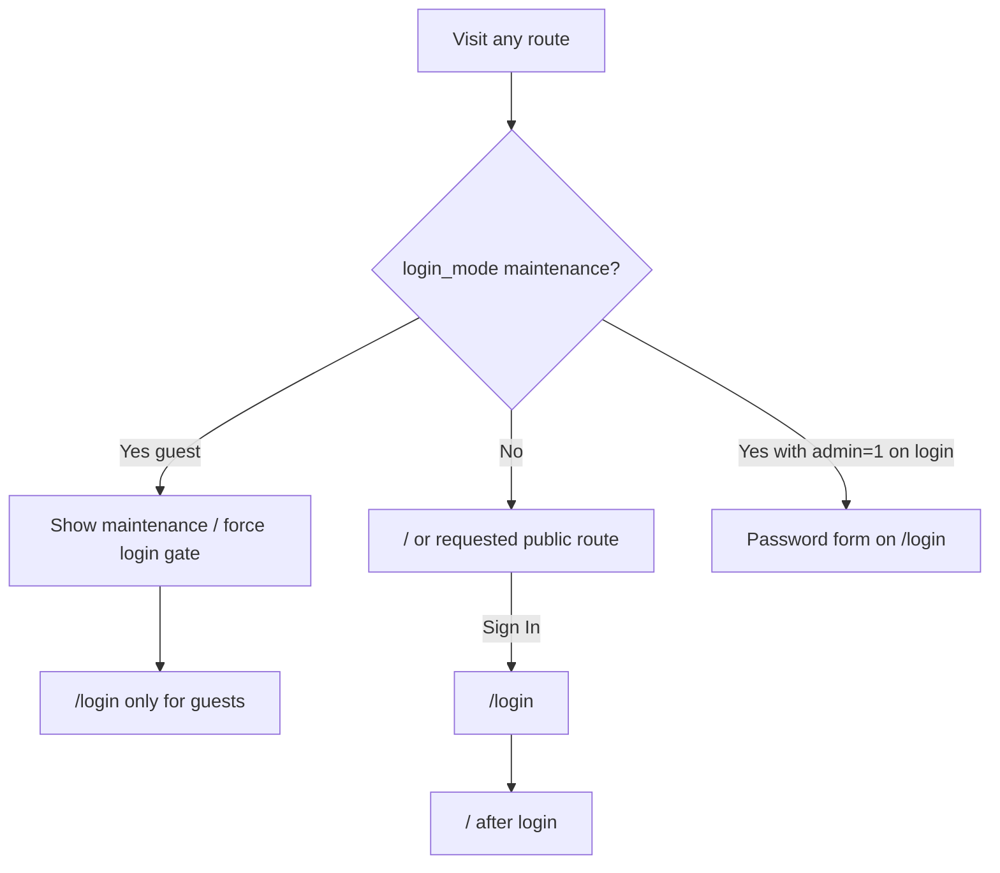

# Guest Knowledge Base Access — Implementation Plan

**Date:** 2026-07-21  
**Status:** Implemented (2026-07-21)  
**Goal:** Unauthenticated visitors can browse the Knowledge Base (search, filter, view). Privileged actions require login.

---

## Locked decisions

| Topic | Decision |
|-------|----------|
| **Public org** | Guests use `PUBLIC_ORG_ID` from the environment (Vite: `VITE_PUBLIC_ORG_ID` and/or server-exposed value — see Phase 2). If unset or no matching org, **fall back to the first organization**. Supports multiple deployments / sites via per-env org ID. |
| **Dark mode** | Guests **can** use dark mode; preference **persisted to `localStorage`**. |
| **Maintenance mode** | When `login_mode === 'maintenance'` (including `LOGIN_MODE` env override), the **entire site** is blocked for guests — including KB browse — not only `/login`. Super-admin bypass remains `?admin=1` on `/login` for password sign-in. |
| **Post-login landing** | Always navigate to **`/`**. Do not honor a `next` deep-link return path. |

---

## Product requirements

| Actor | Can do | Cannot do |
|-------|--------|-----------|
| **Guest** (unauthenticated) | Land on `/` (home); search / filter / view documents (`visibility === 'everyone'`) in the public org; open document detail; toggle dark mode (persisted) | See left-hand nav; see header action icons (notifications, settings entry points, user chrome beyond Sign In); add/edit/delete docs; open Settings; see notifications/messages; browse KB while site is in maintenance |
| **Authenticated user** | Everything a guest can (when not in maintenance), plus Settings, create/edit documents, notifications/messages, org switching as today | — |

**Navigation model**

- Default entry for everyone: **`/`** (Knowledge Base), not `/login` — **except** when maintenance mode is active (see below).
- Guests who need privileged features go to **`/login`** (Sign In control).
- After login, always land on **`/`**.

**Maintenance (whole-site)**

- Guests: if maintenance → cannot use KB; send them to a maintenance experience (dedicated page or `/login` with maintenance message only).
- Authenticated sessions already in the app: **recommend** also blocking or logging out guests-of-maintenance — for v1, at minimum block unauthenticated KB; optionally redirect authenticated non–super-admins away later (call out in implementation if needed).
- Super admin: `/login?admin=1` still reveals password form.

---

## Current state (why this is needed)

Today [`src/App.jsx`](../../src/App.jsx) mounts `AppLayout` only when `isAuthenticated`; all other routes redirect to `/login`. Guests never reach the Dashboard.

Even if routing were opened, [`src/lib/OrgContext.jsx`](../../src/lib/OrgContext.jsx) leaves `currentOrg = null` when there is no user, so Dashboard shows “No organization selected.”

Dark mode today toggles the `dark` class but is **not** persisted (`AppLayout.jsx`).

The API is still open (no JWT on entity routes), so **frontend route + UI gating** is the real boundary for this feature. Server-side public read rules should be added later when full auth lands ([`login-mode-fullauth.md`](./login-mode-fullauth.md)).

---

## Target UX

### Guest chrome (`AppLayout`)

**Visible**

- Brand / logo → `/` (when not in maintenance)
- **Dark mode toggle** (read/write `localStorage`, e.g. `kbb_dark_mode`)
- **Sign In** → `/login`

**Hidden**

- Entire left sidebar (desktop) and mobile hamburger/nav overlay
- `NotificationBell`
- User avatar / name / logout
- Settings (sidebar only today)

### Authenticated chrome

Unchanged from today: sidebar (Knowledge Base + Settings), notifications, user menu, dark mode (also persisted).

---

## Route matrix

| Path | Guest (normal) | Guest (maintenance) | Authenticated |
|------|----------------|---------------------|---------------|
| `/` | Dashboard (read-only CTAs) | Blocked → maintenance / `/login` | Dashboard (full) |
| `/documents/:id` | DocumentView if `everyone` in public org | Blocked | DocumentView per visibility |
| `/documents/new` | → `/login` | → `/login` | DocumentForm |
| `/documents/:id/edit` | → `/login` | → `/login` | DocumentForm |
| `/settings` | → `/login` | → `/login` | Settings |
| `/login` | Login forms per login mode | Maintenance message; `?admin=1` → password | → `/` |

---

## Implementation phases

### Phase 1 — Routing (`src/App.jsx`)

1. Always wrap KB shell routes in `AppLayout` for authenticated **and** guest (when not maintenance-gated).
2. Public routes: `/`, `/documents/:id` — only when **not** in maintenance for guests.
3. Protected routes: `/settings`, `/documents/new`, `/documents/:id/edit` — if `!isAuthenticated`, `<Navigate to="/login" />` (no `next` param).
4. Default unauthenticated entry is `/`, not `/login`.
5. `/login` when already authenticated → `<Navigate to="/" replace />`.
6. Maintenance gate (guest): any public KB route redirects to maintenance UX / `/login`.

Optional: thin `RequireAuth` wrapper; delete or rewrite stale `ProtectedRoute.jsx`.

### Phase 2 — Public org context (`src/lib/OrgContext.jsx`)

When `!user`:

1. Resolve org:
   - Read **`PUBLIC_ORG_ID`** (expose to client as `VITE_PUBLIC_ORG_ID` in `.env.local`, since OrgContext runs in the browser; keep server env name documented as the same logical setting for multi-site deploys).
   - If set and an org with that `id` exists → use it.
   - Else → **first organization** from `Organization.list()` (prefer `is_active` if available).
2. Set `currentOrg` (and `orgs` as `[currentOrg]` or full list read-only — guests do not get OrgSwitcher).
3. `isOrgAdmin` remains false.
4. No membership / `localStorage` org requirement for guests.

When user logs in, existing membership-based org resolution takes over.

### Phase 3 — Dashboard guest mode (`src/pages/Dashboard.jsx`)

1. Load documents for guest `currentOrg`.
2. Guests: only `visibility === 'everyone'` and not archived.
3. Hide Add Item, FAB, archived toggle, admin-only actions.
4. Keep search + site/department filters.
5. Empty state if no org resolves: “Knowledge Base unavailable.”

### Phase 4 — Document view (`src/pages/DocumentView.jsx`)

1. Works for guests with public org context.
2. Team-restricted or wrong-org docs → redirect `/` (avoid leaking details).
3. Edit/Delete stay behind `canEdit` (false for guests).
4. File preview for `everyone` docs continues (API open today).

### Phase 5 — Layout + dark mode persistence (`src/components/layout/AppLayout.jsx`)

1. Guest: hide sidebar, mobile menu, `NotificationBell`, avatar/logout; show Sign In.
2. Dark mode for **all** users:
   - Initialize from `localStorage` (e.g. `kbb_dark_mode` = `'1'` / `'0'`).
   - On toggle, update `document.documentElement` **and** `localStorage`.
3. Authenticated chrome otherwise unchanged.

### Phase 6 — Login landing (`src/pages/Login.jsx`)

1. After successful select or password login → **`navigate('/')` always**.
2. No `?next=` handling.

### Phase 7 — Whole-site maintenance gate

1. On app bootstrap (or route level), fetch public `login_mode` (existing settings API).
2. If `maintenance` and `!isAuthenticated`:
   - Do not render KB (`/`, `/documents/:id`).
   - Show maintenance message (reuse `maintenance_message` setting) and path to `/login`.
   - `/login` behavior unchanged (message; `?admin=1` password bypass).
3. Document that `LOGIN_MODE=maintenance` locks the full guest surface for that deployment.

### Phase 8 — Docs / env

Document in [`auth-env-notes.md`](./auth-env-notes.md):

| Variable | Purpose |
|----------|---------|
| `VITE_PUBLIC_ORG_ID` | Org UUID guests browse; unset → first org |
| `LOGIN_MODE` / DB `login_mode` | `maintenance` blocks entire guest site including KB |
| Existing auth vars | Unchanged |

### Phase 9 — Forward-compat with full auth (later)

When API JWT middleware lands ([`login-mode-fullauth.md`](./login-mode-fullauth.md)):

- Allow unauthenticated **read** of everyone-docs + supporting metadata for the public org.
- Keep writes / settings PUT authenticated.
- Optionally enforce maintenance with HTTP `503` for anonymous API reads.

---

## Files to touch (checklist)

| File | Change |
|------|--------|
| [`src/App.jsx`](../../src/App.jsx) | Public vs protected routes; maintenance guest gate; always mount layout for KB when allowed |
| [`src/lib/OrgContext.jsx`](../../src/lib/OrgContext.jsx) | Guest org via `VITE_PUBLIC_ORG_ID` → else first org |
| [`src/pages/Dashboard.jsx`](../../src/pages/Dashboard.jsx) | Guest load + hide write CTAs |
| [`src/pages/DocumentView.jsx`](../../src/pages/DocumentView.jsx) | Guest-safe view + deny restricted |
| [`src/components/layout/AppLayout.jsx`](../../src/components/layout/AppLayout.jsx) | Guest chrome; dark mode `localStorage` |
| [`src/pages/Login.jsx`](../../src/pages/Login.jsx) | Always post-login `/` |
| [`.env.local`](../../.env.local) / [`auth-env-notes.md`](./auth-env-notes.md) | `VITE_PUBLIC_ORG_ID` |
| [`src/components/ProtectedRoute.jsx`](../../src/components/ProtectedRoute.jsx) | Rewrite or delete |

**Likely unchanged:** Settings, DocumentForm (route-gated), Login Mode settings UI (still configures mode/message).

---

## Out of scope (v1)

- Per-document public share links / anonymous tokens
- Guest comments or uploads
- Guest OrgSwitcher
- Post-login deep-link return (`next`)
- Changing Login Mode button UX (only how maintenance is enforced site-wide)

---

## Verification checklist

1. Logged out, normal mode → `/` shows KB; no sidebar; no notification bell; Sign In + dark mode visible; dark preference survives refresh.
2. `VITE_PUBLIC_ORG_ID` set → guest sees that org’s everyone docs; unset → first org.
3. Open everyone doc → view works; no Edit/Delete. Team-restricted ID → denied/home.
4. Sign In → after login always `/`; sidebar + notifications + Add Item work.
5. Guest `/settings` or `/documents/new` → `/login` (no return-to-deep-link required).
6. `login_mode` / `LOGIN_MODE=maintenance` → guest cannot open `/` KB; sees maintenance; `/login?admin=1` still allows password login for super admin.

---

## Suggested implementation order

1. Phase 5 dark mode persistence + guest chrome  
2. Phase 1 routing + Phase 7 maintenance gate  
3. Phase 2 OrgContext + Phase 3 Dashboard  
4. Phase 4 DocumentView  
5. Phase 6 login → `/`  
6. Phase 8 env docs  
